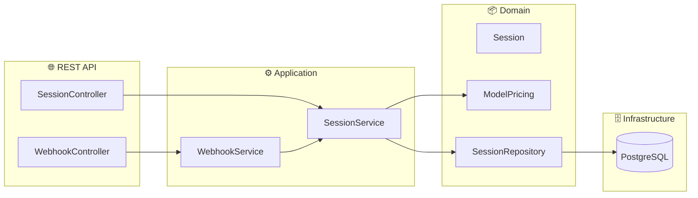

# 🐱 Arenita Tracking

Microservicio de tracking de costos y uso para la plataforma Arenita (OpenClaw-based).

## Stack
- **Kotlin** + **Spring Boot 3**
- **PostgreSQL** (H2 para desarrollo)
- **Spring Data JPA** + **Spring WebFlux**
- **OpenAPI/Swagger** para documentación

## Quick Start

### Desarrollo (H2 en memoria)
```bash
./gradlew bootRun --args='--spring.profiles.active=dev'
```

### Producción (Docker)
```bash
docker-compose up -d
```

### Swagger UI
```
http://localhost:8081/webjars/swagger-ui/index.html
```

## API Endpoints

| Method | Path | Description |
|--------|------|-------------|
| POST | `/api/v1/sessions` | Registrar evento de sesión |
| GET | `/api/v1/sessions` | Listar sesiones (filtros: userId, from, to) |
| PUT | `/api/v1/sessions/{id}/purpose` | Override manual de propósito |
| GET | `/api/v1/users/{userId}/summary` | Resumen de uso por usuario |
| GET | `/api/v1/users/{userId}/costs` | Desglose de costos por usuario |
| GET | `/api/v1/analytics/overview` | Dashboard global de analytics |
| GET | `/api/v1/analytics/purposes` | Distribución de propósitos |
| POST | `/api/v1/webhook/openclaw` | Webhook para eventos de OpenClaw |

## Arquitectura



### Paquetes
```
com.arenita.tracking/
├── domain/          # Entidades y repositorios
├── application/     # Servicios de negocio
├── infrastructure/  # Web, config, persistence
└── api/             # DTOs y mappers
```

## Features
- 💰 **Cost tracking** por sesión con pricing configurable por modelo
- 📊 **Analytics** de volumen por usuario (diario/semanal/mensual)
- 📁 **Data type tracking** (text, PDF, image, CSV, voice)
- ⏱️ **Time tracking** por conversación
- 🎯 **Purpose classification** (work, personal, emotional, technical, creative)
- 🔗 **Webhook** para integración con OpenClaw

## Modelos de pricing incluidos
- Claude Opus 4, Sonnet 4, Haiku 3.5
- GPT-4o, GPT-4o-mini
- Gemini 2.0 Flash

## Licencia
MIT
